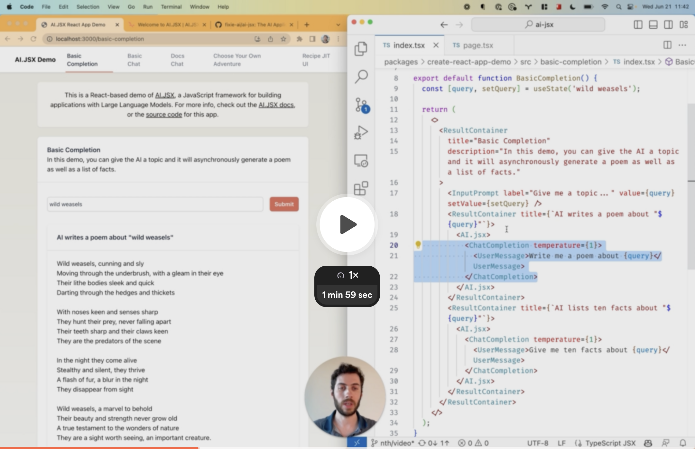

# AI.JSX — The AI Application Framework for Javascript

[](https://docs.ai-jsx.com)
[](https://discord.gg/MsKAeKF8kU)
[](https://twitter.com/fixieai)

[](https://www.loom.com/share/c13b0c73f8d34f9f962048b39a4794f6)

<div style="position: relative; padding-bottom: 64.63195691202873%; height: 0;"><iframe src="https://www.loom.com/embed/c13b0c73f8d34f9f962048b39a4794f6?sid=bfa5b918-e135-42d8-a4ef-2c2ce3d9fc83" frameborder="0" webkitallowfullscreen mozallowfullscreen allowfullscreen style="position: absolute; top: 0; left: 0; width: 100%; height: 100%;"></iframe></div>

AI.JSX is a framework for building AI applications using Javascript and [JSX](https://react.dev/learn/writing-markup-with-jsx). While AI.JSX [is not React](https://docs.ai-jsx.com/is-it-react), it's designed to look and feel very similar while also integrating seamlessly with React-based projects. With AI.JSX, you don't just use JSX to describe what your UI should look like, you also use it to describe how **Large Language Models**, such as ChatGPT, should integrate into the rest of your application. The end result is a powerful combination where _intelligence_ can be deeply embedded into the application stack.

AI.JSX is designed to give you two important capabilities out of the box:

1. An intuitive mechanism for orchestrating multiple LLM calls expressed as modular, re-usable components.
1. The ability to seamlessly interweave UI components with your AI components. This means you can rely on the LLM to construct your UI dynamically from a set of provided React components.

AI.JSX can be used to create standalone LLM applications that can be deployed anywhere Node.JS is supported, or it can be used as part of a larger React application. For an example of how to integrate AI.JSX into a React project, see the [NextJS demo package](/packages/nextjs-demo/) or [follow the tutorial](https://docs.ai-jsx.com/tutorial/part5). For an overview of all deployment architectures, see the [architecture overview](https://docs.ai-jsx.com/guides/architecture).

For more details on how AI.JSX works with React in general, see our [AI+UI guide](https://docs.ai-jsx.com/guides/ai-ui).

## Quickstart

1. Follow the [Getting Started Guide](https://docs.ai-jsx.com/getting-started)
1. Run through the [tutorial](https://docs.ai-jsx.com/category/tutorial)
1. Clone our [Hello World template](https://github.com/fixie-ai/ai-jsx-template) to start hacking
1. Check out the different examples in the [examples package](https://github.com/fixie-ai/ai-jsx/tree/main/packages/examples)
1. If you're new to AI, read the [Guide for AI Newcomers](https://docs.ai-jsx.com/guides/brand-new)

## Examples

You can play with live demos on our [live demo app](https://ai-jsx-nextjs-demo.vercel.app/) (source is available [here](./packages/nextjs-demo/)).

Here is a simple example using AI.JSX to generate an AI response to a prompt:

```tsx
import * as AI from 'ai-jsx';
import { ChatCompletion, UserMessage } from 'ai-jsx/core/completion';

const app = (
  <ChatCompletion>
    <UserMessage>Write a Shakespearean sonnet about AI models.</UserMessage>
  </ChatCompletion>
);
const renderContext = AI.createRenderContext();
const response = await renderContext.render(app);
console.log(response);
```

Here's a more complex example that uses the built-in `<Inline>` component to progressively generate multiple fields in a JSON object:

```tsx
function CharacterGenerator() {
  const inlineCompletion = (prompt: Node) => (
    <Completion stop={['"']} temperature={1.0}>
      {prompt}
    </Completion>
  );

  return (
    <Inline>
      Generate a character profile for a fantasy role-playing game in JSON format.{'\n'}
      {'{'}
      {'\n  '}"name": "{inlineCompletion}",
      {'\n  '}"class": "{inlineCompletion}",
      {'\n  '}"race": "{inlineCompletion}",
      {'\n  '}"alignment": "{inlineCompletion}",
      {'\n  '}"weapons": "{inlineCompletion}",
      {'\n  '}"spells": "{inlineCompletion}",
      {'\n}'}
    </Inline>
  );
}
```

For a full set of examples, see [the examples package](https://github.com/fixie-ai/ai-jsx/tree/main/packages/examples).

## Features

- Prompt engineering through modular, reusable components
- The ability to easily switch between model providers and LLM configurations (e.g., temperature)
- Built in support for Tools (ReAct pattern), Document Question and Answering, Chain of Thought, and more
- Ability to directly interweave LLM calls with standard UI components, including the ability for the LLM to render the UI from a set of provided components
- Built-in streaming support
- First-class support for NextJS and Create React App (more coming soon)
- Full support for LangChainJS

## Contributing

We welcome contributions! See [Contributing](packages/docs/docs/contributing/index.md) for how to get started.
